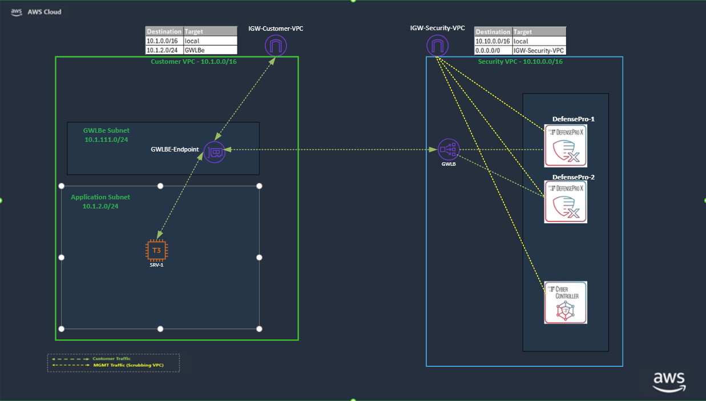

# Radware DefensePro AWS Terraform Deployment

This Terraform project deploys a complete Radware DefensePro DDoS-protection infrastructure on AWS, including a Customer VPC with a target server, a Scrubbing VPC with two DefensePro instances and a Cyber Controller, and a Gateway Load Balancer to route traffic through the scrubbing environment.

---

## Tested Versions

This Terraform configuration has been tested with the following Radware software versions:

| Component | Tested Versions |
|---|---|
| Cyber Controller | 10.7, 10.12 |
| DefensePro | 10.8.0.0_b118, 10.10.4.3_b500 |

---

## Architecture Overview

- **Customer VPC** — Application subnet with a target server (Apache) and a Gateway Load Balancer endpoint
- **Scrubbing VPC** — Two DefensePro instances (data + management interfaces) and one Cyber Controller
- **Gateway Load Balancer** — Routes customer traffic through DefensePro for inspection and scrubbing
- **Default region** — `eu-north-1`; AMI IDs are region-specific

---

## Prerequisites

### 1. Install Dependencies (Ubuntu)

Run the included installer script — it installs Terraform, AWS CLI, and all other required tools automatically:

```bash
chmod +x install_dependencies.sh
./install_dependencies.sh
```

> For other operating systems, install Terraform manually from https://www.terraform.io/downloads.html and AWS CLI from https://docs.aws.amazon.com/cli/latest/userguide/install-cliv2.html

### 2. Configure AWS CLI

```bash
# Install AWS CLI if not present
pip install awscli

# Configure credentials
aws configure
# Enter your Access Key ID, Secret Access Key, Region, and output format

# Verify
aws sts get-caller-identity
```

---

## Step-by-Step Deployment Guide

### Step 1 — Prepare Configuration

1. Navigate to the project directory:
   ```bash
   cd radware-defensepro-aws-terraform
   ```

2. Create your configuration file from the example:
   ```bash
   cp terraform.tfvars.example terraform.tfvars
   ```

3. If you want to change any default values, edit `terraform.tfvars`:
   ```bash
   nano terraform.tfvars
   ```

   **Required variables (no defaults — Terraform will prompt if not set):**
   ```hcl
   aws_region              = "eu-north-1"    # AWS region to deploy into
   resource_name_username  = "your-name"     # Included in resource name suffixes
   cyber_controller_ami_id = "ami-0908b747ea20df193"  # region-specific
   defensepro_ami_id       = "ami-061f99d84c3c52c61"  # region-specific
   ```

   > **Note:** The provided AMI IDs are for the **eu-north-1** region only. Contact Radware support for AMI IDs in other regions.

   **Optional overrides (defaults shown):**
   ```hcl
   deployment_index               = "1"              # Unique index appended to resource names
   project_name                   = "MyProject"      # Tag applied to all resources
   customer_vpc_cidr              = "10.1.0.0/16"
   scrubbing_vpc_cidr             = "10.10.0.0/16"
   application_subnet_cidr        = "10.1.2.0/24"
   glb_endpoint_subnet_cidr       = "10.1.111.0/24"
   scrubbing_mgmt_subnet_cidr     = "10.10.1.0/24"
   defensepro_data_subnet_cidr    = "10.10.2.0/24"
   availability_zone_suffix_1     = "a"
   availability_zone_suffix_2     = "b"
   cc_instance_type               = "g4dn.4xlarge"
   dp_1_instance_type             = "r5n.large"
   dp_2_instance_type             = "r5n.large"
   target_srv_instance_type       = "t3.micro"
   target_srv_ami_id              = "ami-0989fb15ce71ba39e"  # Ubuntu 22.04 LTS (eu-north-1)
   admin_computer_network_for_ssh = "0.0.0.0/0"             # Restrict to your IP in production
   ```

### Step 2 — Initialize Terraform

```bash
terraform init -upgrade
```

Expected output:
```
Initializing the backend...
Initializing provider plugins...
- Downloading plugin for provider "aws"...
- Downloading plugin for provider "tls"...
- Downloading plugin for provider "local"...

Terraform has been successfully initialized!
```

### Step 3 — Plan the Deployment

```bash
terraform plan -out=defensepro-deployment.tfplan
```

Review the output carefully to verify all resources (VPCs, subnets, instances, load balancers) before applying.

### Step 4 — Apply the Configuration

```bash
terraform apply defensepro-deployment.tfplan
```

**Expected deployment time:** 10–15 minutes

> **Note:** As part of `terraform apply`, the Cyber Controller network configuration (management IP, netmask, gateway) is set automatically via SSH — no manual action is required.

```
╔══════════════════════════════════════════════════════════════════════════════╗
║                  RADWARE DEFENSEPRO DEPLOYMENT SUMMARY                      ║
╠══════════════════════════════════════════════════════════════════════════════╣

   CYBER CONTROLLER
      Public IP:  X.X.X.X
      Private IP: 10.10.1.20
      Web URL:    https://X.X.X.X
      SSH:        ssh admin@X.X.X.X

   DEFENSEPRO-1
      Public IP:  X.X.X.X
      Mgmt IP:    10.10.1.10
      Data IP:    10.10.2.10
      SSH:        ssh admin@X.X.X.X

   DEFENSEPRO-2
      Public IP:  X.X.X.X
      Mgmt IP:    10.10.1.11
      Data IP:    10.10.2.11
      SSH:        ssh admin@X.X.X.X

   TARGET SERVER (Apache)
      Public IP:  X.X.X.X
      Private IP: 10.1.2.20
      Web URL:    http://X.X.X.X (after Apache installation)
      SSH Key:    ./target_server_key.pem

╚══════════════════════════════════════════════════════════════════════════════╝
```

### Step 5 — License Configuration (REQUIRED)

> **Warning:** Do NOT run the post-deployment script in Step 6 until licensing is complete.

1. Open the Cyber Controller web interface:
   ```
   https://<CC_PUBLIC_IP>
   ```
   - **Username:** `radware`
   - **Password:** `radware`
   - Accept the SSL certificate warning

2. After login, the Cyber Controller will automatically prompt you with the MAC address of the CC and ask you to provide the activation license.

3. Enter the **Cyber Controller license (vision-activation)** when prompted.

### Step 6 — Run the Post-Deployment Script

After licensing is complete:

```bash
chmod +x add_dp_to_cc_unified.sh
./add_dp_to_cc_unified.sh
```

This script will:
1. Add DefensePro-1 and DefensePro-2 to the Cyber Controller
2. Install Apache on the target server

---

## Traffic Flow & Routing

### Network Topology



```
                        INTERNET
                            │
                            ▼
              ┌─────────────────────────────┐
              │       CUSTOMER VPC          │
              │       (10.1.0.0/16)         │
              │                             │
              │  Internet Gateway (IGW)     │
              │         │   ▲              │
              │  IGW Ingress Route Table    │
              │  10.1.2.0/24 → GWLBe       │
              │         │   │              │
              │         ▼   │              │
              │  GLB Endpoint Subnet        │
              │  (10.1.111.0/24)            │
              │  GWLBe Route Table          │
              │  0.0.0.0/0 → IGW           │
              │         │   ▲              │
              └─────────┼───┼──────────────┘
                        │   │  GENEVE tunnel (UDP 6081)
              ┌─────────┼───┼──────────────────────────┐
              │         ▼   │   SCRUBBING VPC           │
              │  Gateway Load Balancer                  │
              │  (DefensePro Data Subnet 10.10.2.0/24)  │
              │         │   ▲                           │
              │    ┌────┘   └────┐                      │
              │    ▼            ▼                       │
              │  DefensePro-1  DefensePro-2             │
              │  eth0 10.10.2.10  eth0 10.10.2.11       │
              │  eth1 10.10.1.10  eth1 10.10.1.11       │
              │                                         │
              │  Cyber Controller (10.10.1.20)          │
              │  (Management only — no data plane)      │
              └──────────────────────────────────────── ┘
                        │   ▲
              ┌─────────┼───┼──────────────┐
              │         ▼   │              │
              │  Application Subnet         │
              │  (10.1.2.0/24)              │
              │  App Route Table            │
              │  0.0.0.0/0 → GWLBe         │
              │                             │
              │  Target Server (10.1.2.20)  │
              └─────────────────────────────┘
```

### Inbound Packet Flow (Internet → Target Server)

1. **Internet → IGW** — Packet arrives at the Customer VPC Internet Gateway destined for the Target Server public IP
2. **IGW → GWLBe** — The IGW ingress route table redirects traffic for `10.1.2.0/24` to the Gateway Load Balancer Endpoint (GWLBe) in subnet `10.1.111.0/24`
3. **GWLBe → GLB** — The GWLBe sends the packet (encapsulated in GENEVE UDP/6081) to the Gateway Load Balancer in the Scrubbing VPC
4. **GLB → DefensePro** — The GLB forwards to one of the two DefensePro instances (`10.10.2.10` or `10.10.2.11`) via their data interface (eth0)
5. **DefensePro inspects the packet** — DDoS scrubbing is applied; clean traffic is returned back through the same GENEVE tunnel
6. **GWLBe → Target Server** — After inspection, the packet is delivered to the Target Server (`10.1.2.20`) in the Application Subnet

### Outbound Packet Flow (Target Server → Internet)

1. **Target Server → GWLBe** — The Application Subnet route table sends all outbound traffic (`0.0.0.0/0`) to the GWLBe
2. **GWLBe → GLB → DefensePro** — Traffic is again forwarded through the Gateway Load Balancer to DefensePro for inspection
3. **DefensePro → GWLBe** — Clean traffic is returned through the GENEVE tunnel
4. **GWLBe → IGW → Internet** — The GWLBe route table sends traffic to the IGW (`0.0.0.0/0 → IGW`), which routes it to the internet

### Route Tables Summary

| Route Table | Associated With | Routes |
|---|---|---|
| IGW Ingress RT | Internet Gateway (edge) | `10.1.2.0/24` → GWLBe |
| GWLBe RT | GLB Endpoint Subnet (10.1.111.0/24) | `0.0.0.0/0` → IGW |
| App-to-GWLBe RT | Application Subnet (10.1.2.0/24) | `0.0.0.0/0` → GWLBe |
| Scrubbing VPC Default RT | DefensePro Data + MGMT subnets | `10.10.0.0/16` → local, `0.0.0.0/0` → Scrubbing IGW |

### DefensePro Interfaces

Each DefensePro instance has two network interfaces:

| Interface | Subnet | Purpose |
|---|---|---|
| eth0 (data) | DefensePro Data Subnet (10.10.2.0/24) | Receives/returns GENEVE-encapsulated traffic from/to GLB |
| eth1 (mgmt) | Scrubbing MGMT Subnet (10.10.1.0/24) | Management access, Cyber Controller communication, public EIP |

---

```bash
# Check all resource status
terraform show

# Retrieve individual output values
terraform output -raw cyber_controller_public_ip
terraform output -raw target_server_public_ip
terraform output -raw defensepro_1_mgmt_private_ip
terraform output -raw defensepro_2_mgmt_private_ip

# Test the Apache web server
TARGET_IP=$(terraform output -raw target_server_public_ip)
curl http://$TARGET_IP
```

---

## Troubleshooting

### DefensePro devices not appearing correctly in Cyber Controller

1. Open the Cyber Controller web interface
2. Navigate to **Device Management**
3. Edit each DefensePro device and click **Save** without making changes — this refreshes the configuration
4. Verify devices appear correctly in the topology view

### Common errors

| Issue | Resolution |
|---|---|
| `terraform init` fails | Run `rm -rf .terraform/ && terraform init -upgrade` |
| AWS authentication error | Run `aws sts get-caller-identity`; reconfigure with `aws configure` |
| Plan/Apply errors | Check `terraform.tfvars`; verify AMI IDs match the target region |
| DefensePro unreachable from CC | Check security groups allow management ports; verify licenses are applied |

```bash
# Enable debug logging for Terraform
TF_LOG=DEBUG terraform apply

# Enable debug output for AWS CLI
aws --debug ec2 describe-instances
```

---

## Cleanup

```bash
# Preview what will be destroyed
terraform plan -destroy

# Destroy all resources
terraform destroy
```

> **Warning:** This permanently deletes all created AWS resources and data.

---

## Project Files

| File | Description |
|---|---|
| `main.tf` | Main infrastructure configuration (VPCs, subnets, instances, load balancers) |
| `variables.tf` | All input variable declarations and defaults |
| `outputs.tf` | Deployment summary and individual sensitive outputs |
| `terraform.tfvars.example` | Example configuration template — copy to `terraform.tfvars` to get started |
| `install_dependencies.sh` | Installs Terraform, AWS CLI, and other dependencies on Ubuntu |
| `run_cc_automation.sh` | Automates initial Cyber Controller SSH network configuration |
| `add_dp_to_cc_unified.sh` | Adds DefensePro devices to Cyber Controller and installs Apache on the target server |

---

## Security Notes

- SSH key pairs are automatically generated by Terraform and stored locally
- Terraform state files contain sensitive data — store them securely (e.g., S3 backend with encryption)
- Never commit `terraform.tfvars` or `*.pem` key files to version control
- Restrict `admin_computer_network_for_ssh` to your actual IP range in production (`0.0.0.0/0` is for testing only)
- Use IAM roles or IAM users with the minimum required permissions

---

## Support

- Review Terraform logs (`TF_LOG=DEBUG`) and AWS console events for resource creation issues
- Consult Radware DefensePro and Cyber Controller product documentation for configuration details
- Verify all prerequisites (licensing, AMI IDs, AWS permissions) before opening a support case
